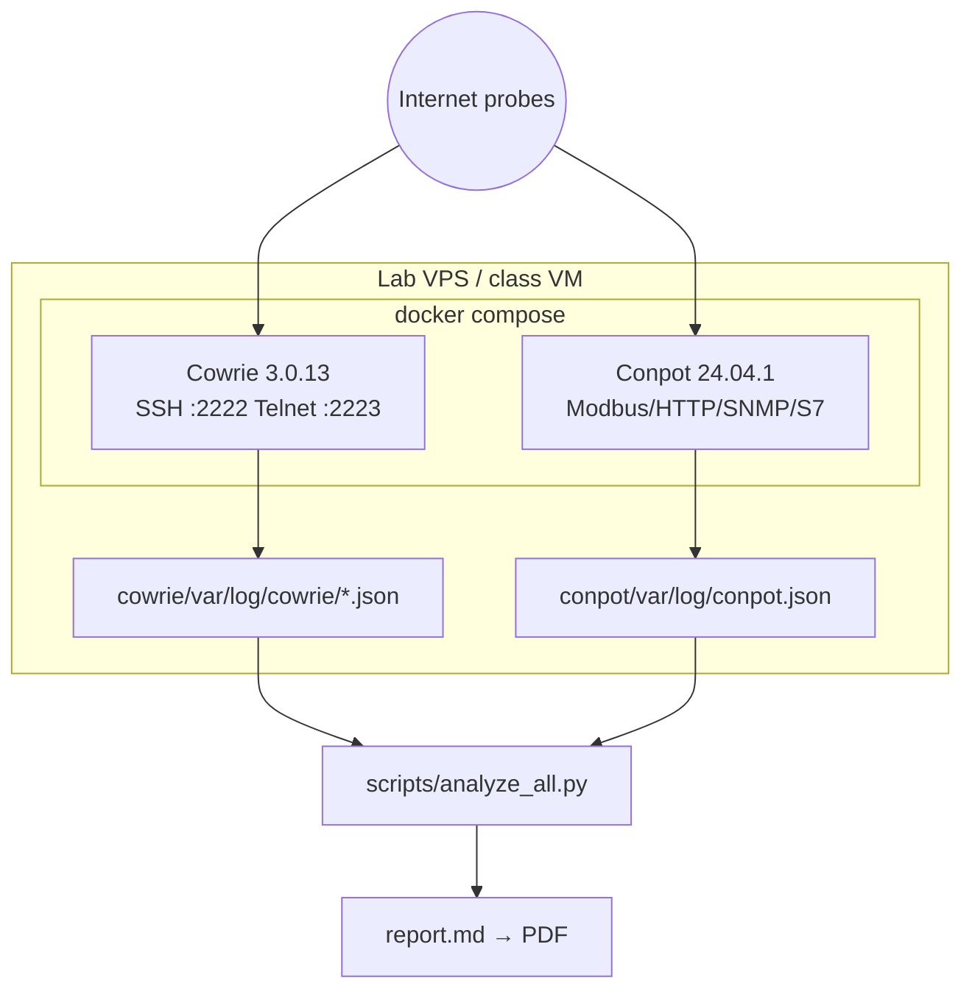

# Class Honeypot (Cowrie + Conpot)

Deployable **Cowrie** (SSH/Telnet) + **Conpot** (ICS/SCADA) honeypots for Tom’s university cybersecurity class. One Docker Compose stack on a **lab VM / VPS you own or that an instructor approved**, collect attacker telemetry, analyze both, and write a report.

> **Ethics first:** only on owned/approved systems. No attacking others. See [docs/ETHICS.md](docs/ETHICS.md).  
> **Class PDF:** [docs/class-guide.pdf](docs/class-guide.pdf) (source: [docs/class-guide.md](docs/class-guide.md)).

## What you get

| Piece | Role |
| --- | --- |
| `docker-compose.yml` | Pinned `cowrie/cowrie:3.0.13` + `dtagdevsec/conpot:24.04.1` |
| `cowrie/etc/cowrie.cfg` | JSON logging, download capture, SSH/Telnet listen ports |
| `conpot/etc/conpot.cfg` | JSON logging overlay (no HPFriends / public-IP fetch) |
| `conpot/etc/WATER_TANK_MAP.md` | Fictional tank/valve register story on default Siemens profile |
| `scripts/analyze_logs.py` | Stdlib Cowrie → markdown |
| `scripts/analyze_all.py` | Stdlib **Cowrie + Conpot** → markdown |
| `scripts/enrich_ips.py` | Optional soft geo/ISP enrichment (fail-soft) |
| `scripts/make_report_pdf.py` | Markdown → PDF (fpdf2 or stdlib fallback) |
| `docs/class-guide.md` / `.pdf` | Deploy path, ethics, expected results |
| `sample-output/` | Fake Cowrie + Conpot samples for screenshots |
| `docs/ETHICS.md` | Deployment rules for class |

## Architecture



| Honeypot | Emulates | Default **host** ports | Container ports | Logs |
| --- | --- | --- | --- | --- |
| **Cowrie** | Ubuntu-like SSH/Telnet | 2222, 2223 | 2222, 2223 | `cowrie/var/log/cowrie/` |
| **Conpot** | Siemens-style PLC / tank story | 5020, 8080, 1161/udp, 1102 | 502, 80, 161/udp, 102 | `conpot/var/log/` |

### Port tradeoff (Conpot)

Scanners often probe **502 / 161 / 102**. This repo defaults to **high host ports** so class deploys need no root and avoid colliding with real services. Document both options:

| Approach | Example | Pros | Cons |
| --- | --- | --- | --- |
| **Class default** | Host `5020→502` | No root; safer on shared VMs | Fewer automated hits |
| **Redirect** | nftables/iptables `502→5020` | Looks like real ICS port | Needs root + dedicated host |
| **Privileged bind** | Host `502:502` (compose uncomment) | Max authenticity | Root / CAP; port conflicts |

Same idea for SNMP `161` and S7 `102`. Details and tank/valve register map: `conpot/etc/WATER_TANK_MAP.md` and `docs/class-guide.md`.

## Telemetry collected

### Cowrie

- Source IP, source port, timestamp  
- SSH client version / banner  
- Username / password attempts  
- Interactive session commands  
- Downloaded files → quarantine (**never execute**)  
- Session connect/close  

### Conpot

- Source IP/port, dest port, timestamp, session id  
- Protocol (`modbus`, `http`, `snmp`, …)  
- Modbus function codes / hex request-response when present  
- HTTP HMI hits, SNMP GETs (template-dependent)  

```text
cowrie/var/log/cowrie/cowrie.json
cowrie/var/lib/cowrie/downloads/    # quarantine
conpot/var/log/conpot.json
conpot/var/log/conpot.log
```

## Quick start

### Requirements

- Docker Engine + Docker Compose v2  
- Linux lab VM / VPS (or local Docker Desktop)  
- Authorization to expose the chosen ports  

### Deploy

```bash
cd /path/to/class-honeypot
cp .env.example .env
mkdir -p cowrie/var/log/cowrie cowrie/var/lib/cowrie/downloads conpot/var/log

# Cowrie often UID 1000; Conpot (dtagdevsec) UID 2000
sudo chown -R 1000:1000 cowrie/var
sudo chown -R 2000:2000 conpot/var/log

docker compose pull
docker compose up -d
docker compose ps
docker compose logs -f --tail=50
docker compose config   # must validate with both services
```

### Smoke-test (owned hosts only)

```bash
ssh -p 2222 root@YOUR_HOST_IP
# HTTP HMI face:
curl -sS http://YOUR_HOST_IP:8080/ | head
```

Do **not** point scanners at networks you don’t own. Do **not** run Modbus write tools against third-party IPs.

### Analyze

```bash
# Both honeypots (preferred)
python3 scripts/analyze_all.py | tee report.md

# Against samples (no live traffic needed)
python3 scripts/analyze_all.py \
  --cowrie sample-output/cowrie.json.sample \
  --conpot sample-output/conpot.json.sample

# Cowrie only
python3 scripts/analyze_logs.py --log sample-output/cowrie.json.sample

# Optional enrichment
python3 scripts/enrich_ips.py --log cowrie/var/log/cowrie/cowrie.json
```

Analysis scripts are **stdlib-only** (Python 3.9+).

### PDF

```bash
python3 scripts/make_report_pdf.py
# or: python3 scripts/make_report_pdf.py --md report.md --out report.pdf
```

Shipped class handout: `docs/class-guide.pdf`.

### Stop / wipe runtime data

```bash
docker compose down
rm -f cowrie/var/log/cowrie/cowrie.json cowrie/var/log/cowrie/cowrie.log
rm -rf cowrie/var/lib/cowrie/downloads/*
rm -f conpot/var/log/conpot.json conpot/var/log/conpot.log
```

## Image pins

```text
cowrie/cowrie:3.0.13
dtagdevsec/conpot:24.04.1
```

`honeynet/conpot` on Docker Hub only publishes an ancient `:latest` (≈2019) — we pin the maintained T-Pot image instead. Re-list tags:

```bash
curl -s 'https://hub.docker.com/v2/repositories/dtagdevsec/conpot/tags?page_size=20' \
  | python3 -c "import sys,json; print('\n'.join(t['name'] for t in json.load(sys.stdin)['results']))"
```

## Repo layout

```text
class-honeypot/
  README.md
  docker-compose.yml
  .env.example
  docs/ETHICS.md
  docs/class-guide.md
  docs/class-guide.pdf
  cowrie/etc/cowrie.cfg
  cowrie/var/...
  conpot/etc/conpot.cfg
  conpot/etc/WATER_TANK_MAP.md
  conpot/var/log/
  scripts/analyze_logs.py
  scripts/analyze_all.py
  scripts/enrich_ips.py
  scripts/make_report_pdf.py
  sample-output/
```

## Class report tips

1. Run 24–72h on an approved host (see expected results in the class guide).  
2. Run `analyze_all.py`; discuss IT volume vs OT dwell.  
3. Map Modbus FCs to the tank/valve story — do not weaponize.  
4. Cite ethics constraints and authorization.  

## Forbidden

- No exploit PoCs, malware runners, or ICS attack tooling  
- No executing files from `downloads/`  
- No scanning / probing third-party networks  

## License / course use

Built for coursework. Cowrie and Conpot are upstream open source; follow their licenses for the images. This wrapper is for defensive classroom telemetry only.
