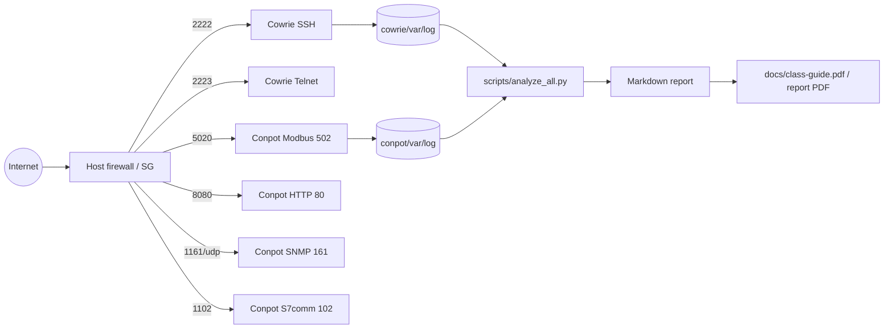

# Class Honeypot Guide — Cowrie + Conpot

**Audience:** Tom’s university cybersecurity class  
**Stack:** Docker Compose honeypots for defensive telemetry only  
**Ethics:** See [ETHICS.md](ETHICS.md) — instructor approval required; never attack third parties.

---

## 1. What systems we emulate

| Component | Interaction | Emulates | Story for class |
| --- | --- | --- | --- |
| **Cowrie** | Medium | Ubuntu-like Linux over **SSH** (and Telnet) | Bastion / jump box `lab-srv01` that bots try to brute-force |
| **Conpot** | Low | Siemens-style **ICS/SCADA** PLC (default template) | **Clearwater Tank Station CW-01** — valves, tank level, pressure |

Together you get both a **“IT”** face (SSH) and an **“OT”** face (Modbus / SNMP / HTTP HMI / S7comm). That mirrors how real internet noise mixes credential stuffing with industrial protocol scanners.

### Tank / valve story (Conpot Modbus)

We keep Conpot’s default Siemens profile (easy to deploy) and **label** registers for a fictional water plant:

- **Coils** = valves open/close / pump enable  
- **Discrete inputs** = float switches / hatch contacts  
- **Analog inputs** = tank level / pressure / flow  
- **Holding registers** = setpoints (level target, pump speed)

Full map: `conpot/etc/WATER_TANK_MAP.md`.

---

## 2. What attacker data you capture

| Data | Cowrie | Conpot |
| --- | --- | --- |
| Source IP / port / time | Yes | Yes |
| Session / connection id | Yes | Yes |
| Protocol / service | SSH, Telnet | Modbus, HTTP, SNMP, S7comm, … |
| Credentials tried | Username + password | N/A (ICS protocols) |
| Interactive commands | Shell commands typed | N/A |
| Client fingerprint | SSH banner / version | HTTP UA / SNMP community / Modbus FC |
| File downloads | Quarantined under `cowrie/var/lib/cowrie/downloads/` | N/A |
| Register / coil access | N/A | Modbus function codes + hex request/response |
| “HMI” web hits | N/A | HTTP paths on port 80 (host 8080 by default) |

**Log paths**

```text
cowrie/var/log/cowrie/cowrie.json     # JSON lines (primary)
cowrie/var/log/cowrie/cowrie.log      # text
cowrie/var/lib/cowrie/downloads/      # quarantine — never execute
conpot/var/log/conpot.json            # JSON lines (primary)
conpot/var/log/conpot.log             # text
```

---

## 3. Why run BOTH?

| Dimension | Cowrie alone | Conpot alone | Both |
| --- | --- | --- | --- |
| **Volume** | High — SSH brute force is constant noise | Lower — fewer hosts speak Modbus/SNMP | You see IT + OT scanners on one IP |
| **Dwell / depth** | Medium — fake shell, commands, malware fetch | Shallow — request/response only | Compare “spray and pray” vs protocol curiosity |
| **Story for reports** | Credential stuffing / botnets | ICS recon / unsafe PLC exposure myths | Same VPS, dual telemetry narrative |
| **Class learning** | Auth abuse, session analysis | Function codes, OT hygiene | Cross-correlation of source IPs |

Running both on one cheap VPS is enough for a 24–72h class observation window without building a full SOC.

---

## 4. Architecture (ports & paths)



### Port table (class defaults)

| Host port | Container | Service | Notes |
| ---: | ---: | --- | --- |
| 2222 | 2222 | Cowrie SSH | Prefer over binding 22 |
| 2223 | 2223 | Cowrie Telnet | Prefer over 23 |
| **5020** | **502** | Conpot Modbus | Class-safe; scanners often want **502** |
| **8080** | **80** | Conpot HTTP HMI | |
| **1161/udp** | **161/udp** | Conpot SNMP | |
| **1102** | **102** | Conpot S7comm | |

**Tradeoff:** High host ports need no root and won’t collide with real daemons, but mass scanners targeting 502/161 may miss you. Options:

1. Keep high ports (safest for class).  
2. Firewall **DNAT/redirect** 502→5020 (and similar) on a dedicated honeypot host.  
3. Bind privileged ports directly (`502:502`, etc.) — needs root / free ports + instructor approval.

Image pins: `cowrie/cowrie:3.0.13`, `dtagdevsec/conpot:24.04.1` (T-Pot build; prefer over unmaintained `honeynet/conpot:latest`).

---

## 5. Free / cheapest deploy path (honest)

Prices below are **approximate as of mid–late 2026** and change often — verify before buying. Amounts are list prices before local VAT/tax.

### Free-ish options (caveats)

| Option | Approx value | Honest caveats |
| --- | --- | --- |
| **Oracle Cloud Always Free (Ampere ARM)** | ~2 OCPU + 12 GB RAM (halved from older 4/24 limits in Jun 2026) | Signup friction; frequent **Out of host capacity**; ARM images (Docker works but some x86-only images fail); card often required |
| **Google Cloud free tier e2-micro** | 1 shared micro VM (~1 GB RAM) in select US regions | Tight RAM for two containers; egress limits; still a billing account |
| **Student / education credits** | Azure / AWS / GCP education grants | Time-limited; must stay inside AUP; don’t leave honeypots on after the class |

**Recommendation:** Try Oracle free **only if** you already have capacity and accept ARM quirks. For a reliable class lab, a **cheap VPS** costs less time than fighting free-tier capacity errors.

### Cheapest reliable paid (~$3–7/mo)

| Provider (examples) | Entry plan (approx) | Notes |
| --- | --- | --- |
| **Hetzner Cloud** | CX23 ~€5.49/mo (~$6) for 2 vCPU / 4 GB / 40 GB NVMe | Strong price/perf; EU-focused; IPv4 may be extra |
| **Contabo** | Cloud VPS 10 / similar ~€5.50/mo | More RAM/cores on paper; slower/noisier than Hetzner in many reviews |
| **OVH / others** | Entry VPS often ~€3.5–5/mo | Fine for honeypots; check fair-use / ToS for honeypot research |

Any **1 vCPU / 1–2 GB RAM** box with a public IPv4 is enough for this Compose stack.

**Do not** run this from a home residential IP for a public internet exposure assignment unless your instructor explicitly allows it.

---

## 6. Step-by-step deploy

### A. Create a VPS

1. Pick a provider above; create Ubuntu 22.04/24.04 (or Debian).  
2. Note the public IPv4.  
3. Open **only** the ports you need in the cloud firewall / security group (see table).  
4. Keep **real admin SSH** on a non-default port or restricted source IP — do not lock yourself out if you later redirect port 22.

### B. Install Docker

```bash
# Ubuntu/Debian sketch — follow current Docker docs if this drifts
sudo apt-get update
sudo apt-get install -y ca-certificates curl
curl -fsSL https://get.docker.com | sudo sh
sudo usermod -aG docker $USER
# log out/in, then:
docker compose version
```

### C. Get this repo and start

```bash
git clone <YOUR_FORK_OR_CLASS_URL> class-honeypot
cd class-honeypot
cp .env.example .env
mkdir -p cowrie/var/log/cowrie cowrie/var/lib/cowrie/downloads conpot/var/log
sudo chown -R 1000:1000 cowrie/var    # Cowrie UID; try 999:999 if needed
# Conpot image runs as UID 2000 — ensure log dir is writable:
sudo chown -R 2000:2000 conpot/var/log

docker compose pull
docker compose up -d
docker compose ps
docker compose logs --tail=50
docker compose config   # validate
```

### D. Open ports / redirects (optional)

- Cloud SG: allow TCP 2222, 2223, 5020, 8080, 1102 and UDP 1161 from `0.0.0.0/0` **only** if the assignment needs public exposure.  
- Optional nftables redirect of 502→5020 (dedicated honeypot host, instructor OK):

```bash
sudo nft add table ip nat
sudo nft 'add chain ip nat PREROUTING { type nat hook prerouting priority -100; }'
sudo nft add rule ip nat PREROUTING tcp dport 502 redirect to 5020
```

### E. Analyze

```bash
# Live logs (after traffic)
python3 scripts/analyze_all.py | tee report.md

# Sample data (no deploy needed)
python3 scripts/analyze_all.py \
  --cowrie sample-output/cowrie.json.sample \
  --conpot sample-output/conpot.json.sample

# Cowrie-only (legacy)
python3 scripts/analyze_logs.py --log sample-output/cowrie.json.sample

# Optional IP enrichment (fail-soft)
python3 scripts/enrich_ips.py --log cowrie/var/log/cowrie/cowrie.json
```

### F. PDF report

```bash
# Regenerate the class guide PDF shipped in docs/
python3 scripts/make_report_pdf.py \
  --md docs/class-guide.md \
  --out docs/class-guide.pdf

# Or turn your analysis markdown into a PDF
python3 scripts/make_report_pdf.py --md report.md --out report.pdf --title "Honeypot Report"
```

`make_report_pdf.py` uses **fpdf2** when available, otherwise a **stdlib** PDF writer (no pip required).

---

## 7. Ethics checklist (before `compose up`)

- [ ] Instructor / lab staff approved the host and public exposure  
- [ ] Not on someone else’s network or shared home Wi-Fi without OK  
- [ ] Admin SSH hardened; honeypot ports intentional  
- [ ] No attack tooling, no scanning third parties, no “hacking back”  
- [ ] Cowrie downloads stay quarantined — **never execute**  
- [ ] Raw logs scrubbed before public sharing  

---

## 8. Sample expected results (24–72h on the open internet)

Numbers vary wildly by IP reputation, region, and whether you listen on classic ports (22/502) vs high ports. Ballpark for a **fresh VPS with high ports open**:

| Signal | 24h (high ports) | 24–72h if 22/502 redirected or bound |
| --- | --- | --- |
| Cowrie connects | Dozens to hundreds | Often thousands of auth attempts |
| Successful Cowrie logins | 0–many (depends on cred policy) | Bots will “get in” and run `uname`, `wget`, crypto miners |
| Cowrie downloads | Rare on high ports; more on 22 | Occasional malware scripts — quarantine only |
| Conpot Modbus/HTTP/SNMP | Sparse on 5020/8080/1161 | Much busier on real 502/80/161 |
| Overlap IPs hitting both | Interesting when present | Great report material |

**On high ports alone**, do not be surprised by a quiet Conpot while Cowrie still sees SSH spray. Document that limitation — it is a valid class finding about scanner defaults.

---

## 9. Forbidden in this project

- Exploit PoCs, malware runners, Modbus “attack” scripts  
- Executing files from `downloads/`  
- Scanning / probing networks you do not own  
- Deploying without authorization  

---

## 10. Quick command cheat sheet

```bash
docker compose up -d
docker compose logs -f --tail=100
python3 scripts/analyze_all.py | tee report.md
python3 scripts/make_report_pdf.py --md report.md --out report.pdf
docker compose down
```

Defensive coursework only. Questions about authorization go to your instructor — not to strangers on the internet.
